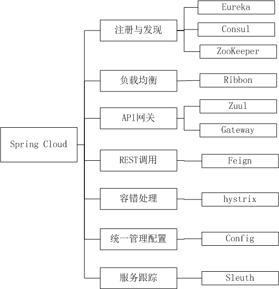

# 微服务框架实践系列 第一篇

## 使用 SpringCloud 構建彈性Web云原生應用




[web-development-scalable-web-app-using-spring-boot-and-spring-cloud](https://medium.com/@nepalBrothers/web-development-scalable-web-app-using-spring-boot-and-spring-cloud-1f9960e1d61a)

包含以下方面的内容

    - Building scalable microservices
    - Building scalable session
    - Scalable authentication
    - API Gateway
这一系列文章讲述如何使用Spring 构建可扩展的Spring Boot微服务架构应用即云原生应用。包括使用Zuul创建连接微服务，使用Consul创建服务，使用Spring Security创建安全性，使用Spring Session创建分布式会话以及使用MongoDB，Redis等产品。

[英文原文](https://medium.com/@nepalBrothers/web-development-scalable-web-app-using-spring-boot-and-spring-cloud-1f9960e1d61a)

### 第一部分：环境搭建

    1.  安装容器运行引擎 Docker

  参考Docker官方文档，在本地机器上安装好Docker Engine，可以通过 *docker info* 。命令检查安装的情况。

    2. 使用Kitematic 工具图形化操作Docker 容器

   我们可以使用Kitematic工具提供的图形化界面来操作Docker。这样可以节省大量命令，使工作更容易启动和运行。


   我们可以使用其搜索功能来安装所需的服务。

    1. 安装MonoDB

  最简单的方式是通过Kitematic 来搜索MongoDB，安装它并运行它。

```bash
docker run -it -d mongo -p 27017:27017
```


  **注意**：配置或更改端口号...

如果我们想要更改端口号怎么办？我们可以通过命令行来这样做，也可以简单地使用Kitematic来操作它。


  可以快速使用Docker来启动和运行任何服务。例如ElasticSearch，Solr，MongoDb，MySQL或Redis或任何其他服务。使用Kitematic可以控制简单测试的基本功能。

### 使用Kotlin，Java，Spring Boot和MongoDB创建Web应用程序

  Spring Boot使编写Web应用程序变得更快。它负责大量配置，让我们很少配置。MongoDB是一个NO-SQL数据库，以文档格式存储数据。它没有像关系数据库那样的任何结构，因此有利有弊。

  我们在这里要做的是创建web-app，提供有关笔记本电脑产品的信息。它将首先使用Spring Data将产品信息存储在MongoDB中，然后使用REST-API向用户公开产品信息。

  要查看代码，请访问：[https://github.com/rockink/product](https://github.com/rockink/product)

#### **创建一个Spring应用程序**

  我们可以使用Spring Initializer为我们创建项目框架。由于我们使用的是Kotlin，我们需要确保我们生成的代码是针对Kotlin的。

  我们需要以下依赖项

- MongoDB使用Spring Data MongoDB
- Web使我们的Spring Boot应用程序创建一个Web应用程序

#### **应用架构**

  我们将使用Model-View-Controller MVC 架构来实现这一点。在设计项目时，遵循架构模式是一个好习惯。


  当用户对我们的产品Web应用程序进行HTTP调用时，我们将以这样的方式设计我们的应用程序，即ProductController类将处理REST-API实现。然后，ProductController将调用ProductService，后者负责处理业务逻辑，我们将使用ProductRepository为我们的web-app提供数据库通信。

#### **产品模型**

  我们现在将创建一个类来保存有关笔记本电脑的信息。我们将为每台笔记本电脑提供唯一的ID。

```kotlin
package com.test.product.models

import org.springframework.data.annotation.Id
import org.springframework.data.mongodb.core.mapping.Document

@Document
data class Product（
        @Id var id：String，
        var name：String，
        var company：String，
        var productType：String，
        val price：Float，
        val sizeInch：Float，
        val screenResolution：String，
        val cpu：String，
        val ram：Int，
        val storage：String，
        val gpu：String，
        val opSys：String 
） ;
```

  用Kotlin的好处是我们可以创建一个类来保存数据。Kotlin为我们自动生成toString（），equals（），hashCode（）方法。这样，我们就不必为它们编写代码。

  在类的顶部有一个注释@Document，它基本上告诉Spring MongoDB将其视为MongoDb文档。并且，@ Id告诉Spring MongoDB将其视为id。

  产品类是我们要保存到MongoDB或从MongoDB中提取的数据的表示。因此，这需要我们在MongoDb和我们的项目之间建立连接。

#### **运行MongoDB**

  我们需要运行MongoDB才能使我们的应用程序与之通信。幸运的是，当MongoDB在其自己的默认端口中运行时，Spring Boot会自动将我们的应用程序连接到它。

  我喜欢不弄乱我的笔记本电脑的方式，所以我在我的机器上安装了Docker。Docker在本地的容器中安装了MongoDB。然后我们可以告诉Docker在我们想要的端口中运行MongoDB。

  参考前面文章讲述如何在本地的机器上运行MongoDB的内容。

#### **通过Repository存储库层与MongoDB进行通信**

  如果将所有内容设置为默认值，则Spring Boot的好处是MongoDB在没有任何其他配置的情况下连接。一旦我们在类路径中拥有Spring Data MongoDb依赖项，它就会为我们设置端口和一切。但是，如果您需要自定义它，例如，设置用户名/密码，您也可以这样做。

  创建产品存储库

  创建产品存储库很简单。我们只需要扩展Spring 提供的Repository

``` kotlin
interface ProductRepository：MongoRepository <Product，String>;
```

  它会自动生成一些API，例如save，findById，delete，findAll。后面我们将的使用这些API。

#### **创建产品服务**

  产品服务是我们的业务逻辑所在的位置。在我们简单的网络应用程序中，我们有以下要求：

  1. 提供所有产品的清单 
  2. 当被要求提供产品ID的产品时，请提供该产品

``` kotlin
@Service
class ProductService(val productRepository: ProductRepository){


    fun getAllProducts(): Collection<Product> {
        return productRepository.findAll();
    }

    fun getProductDetailById(id: String): Product? {
        val product = productRepository.findById(id);
        if(!product.isPresent) {
            throw ProductNotFoundException("Product id=$id not found")
        }
        return product.get();
    }
}
```

  让我们来看看我们已经完成了那些：

- productRepository是我们在上面的步骤中实现的存储库。在构造函数中使用它意味着我们让Spring的依赖注入为我们提供了productRepository实现。
- @Service注释意味着我们告诉Spring Boot将其视为Bean，这意味着我们告诉Spring“Spring，这个类是一个服务。将其视为一项服务，并在我的应用程序需要时提供我的应用程序。”
- 未找到产品时，ProductNotFoundException是项目中的异常。

#### **通过ProductController公开API**

  在下面的实现中，我们通过使用@RestController注释它来公开ProductController 。

``` kotlin
@RestController
@RequestMapping
class ProductController(val productService: ProductService){

    val logger = Logger.getLogger(ProductController::class.java.canonicalName);

    @GetMapping
    fun getAllProducts(): MutableMap<String, Collection<Product>> {
        val productMap = mutableMapOf<String, Collection<Product>>();
        productMap["products"] = productService.getAllProducts();
        return productMap;
    }


    @GetMapping("/{id}")
    fun getProductDetail(@PathVariable("id") id: String): ResponseEntity<ProductRespose> {

        val product = productService.getProductDetailById(id)
        logger.info("product $product");

        if(product == null) {
            return ResponseEntity
                    .status(HttpStatus.NOT_FOUND).body(ProductRespose(product));
        }

        val productResponse = ProductRespose(product);
        logger.info("productResponse $productResponse")

        return ResponseEntity.ok(productResponse);
    }

}
```

#### **让Spring引导这个应用程序**

  Spring不会自动运行。我们需要引导我们的应用程序，以便它进入Spring环境。幸运的是，IDE通常会自动为您创建它。我们这样做：

``` kotlin

    public static void main(String[] args) {
        SpringApplication.run(ProductApplication.class, args);
    }
  
```

#### **应用程序需要的产品数据在哪里？**

  此时，我们还没有加载产品。我从Kaggle下载了笔记本电脑信息，该信息是csv格式并上传了< root directory>/data folder目录。

  我们首先需要在我们的数据库中上传这些产品。Spring为我们提供了一个接口CommandLineRunner来实现run方法。我们可以实现它来加载数据库中的数据。

``` kotlin
package com.test.product;

import org.springframework.beans.factory.annotation.Autowired;
import org.springframework.boot.CommandLineRunner;
import org.springframework.boot.SpringApplication;
import org.springframework.boot.autoconfigure.SpringBootApplication;

import java.util.HashMap;
import java.util.logging.Logger;

@SpringBootApplication
public class ProductApplication implements CommandLineRunner {

    private final ProductRepository productRepository;
    private final Logger logger = Logger.getLogger(ProductApplication.class.getName());

    public ProductApplication(ProductRepository productRepository){
        this.productRepository = productRepository;
    }

    public static void main(String[] args) {
        SpringApplication.run(ProductApplication.class, args);
    }

    /**
     * Loads up the data into the mongoDB for the use in the app.
     * @param args
     * @throws Exception
     */
    @Override
    public void run(String... args) throws Exception {
        if(productRepository.count() > 0) return;
        logger.info("Repository is empty, adding products");
        HashMap<Long, Product> products = DummyProductRepoPolulator.INSTANCE.populate();

        products.values()
                .parallelStream()
                .forEach(productRepository::save);

    }
}

```

  而DummyProdutRepoPopulator类如下：

``` kotlin
object DummyProductRepoPolulator {

    private val logger = Logger.getLogger(DummyProductRepoPolulator::class.qualifiedName);

    fun populate(): HashMap<Long, Product> {
        val productMap = hashMapOf<Long, Product>();
        populateLaptops(productMap);
        return productMap;
    }

    private fun populateLaptops(productMap: HashMap<Long, Product>) {
        val productFile = File("data/laptops.csv");

        val scanner = Scanner(productFile);

        //read the headers
        val headers = scanner.nextLine().split(",");
        val headersMap = hashMapOf<String, Int>()
        repeat(headers.size) {
            headersMap[headers[it].toLowerCase()] = it;
        }

        // read the data
        while (scanner.hasNextLine()) {
            val laptopProductInfo = scanner.nextLine().split(",");

            repeat(laptopProductInfo.size) {
                logger.info("Data: $it - ${laptopProductInfo[it]}")
            }

            //save by id
            productMap[laptopProductInfo[0].toLong()] = Product(
                    id = laptopProductInfo[headersMap["id"]!!],
                    name = laptopProductInfo[headersMap["product"]!!],
                    company = laptopProductInfo[headersMap["company"]!!],
                    productType = "laptop",
                    price = laptopProductInfo[headersMap["price_euros"]!!].toFloat(),
                    sizeInch = laptopProductInfo[headersMap["inches"]!!].toFloat(),
                    screenResolution = laptopProductInfo[headersMap["screenresolution"]!!],
                    cpu = laptopProductInfo[headersMap["cpu"]!!],
                    ram = laptopProductInfo[headersMap["ram"]!!].replace("GB", "").toInt(),
                    storage = laptopProductInfo[headersMap["memory"]!!],
                    gpu = laptopProductInfo[headersMap["gpu"]!!],
                    opSys = laptopProductInfo[headersMap["opsys"]!!]
            );
        }
    }

}
```

#### **运行项目**

  确保MongoDB正在运行后，我们可以运行此应用程序。之后，我们可以使用curl或在浏览器中进行测试

``` bash
http://localhost:8080
```

```bash

curl http://localhost:8080/1

{ “product”：{ “id”：“1”，“name”：“MacBook Pro”，“company”：“Apple”，“productType”：“laptop”，“price”：1339.69，“sizeInch”：13.3 ，“screenResolution”：“IPS Panel Retina Display 2560x1600”，“cpu”：“Intel Core i5 2.3GHz”，“ram”：8，“storage”：“128GB SSD”，“gpu“ ：”Intel Iris Plus Graphics 640“，”opSys“：”macOS“}}

```

英文原文：
[Creating web-app using Kotlin, Java, Spring Boot & MongoDB](https://medium.com/@nepalBrothers/creating-web-app-using-kotlin-java-spring-boot-mongodb-9619484d5f02)

### 使用Kotlin，Spring Security，Redis和Spring Session构建可扩展的安全Web应用程序

[代码在这里](https://github.com/rockink/account)

在当今世界构建可扩展的解决方案是必要的，也是一种良好的实践。构建任何网站的挑战之一是找到处理用户身份验证的正确方法。另一个挑战是使身份验证可扩展。

我们将在这里学习如何使用Spring Security，Redis和Spring Session为我们的Account应用程序提供安全性。

让我们从web-app开始（没有安全性）
这很容易入手。Spring Initializer对我来说是一个转到的地方。由于这是一个Kotlin项目，让我们将它构建为具有以下依赖项的Kotlin项目：

1. Web
  创建任何端点

``` kotlin 
import org.springframework.web.bind.annotation.GetMapping
import org.springframework.web.bind.annotation.RestController

@RestController
class AccountController{

    @GetMapping
    fun insecureResource(): HashMap<String, String> {
        val returnMap = hashMapOf<String, String>();
        returnMap["message"] = "hello everyone!";
        return returnMap;
    }
}
```

运行一下：

我们可以使用 *maven* 命令行或喜欢的IDE来为我们做。

``` bash
mvn spring-boot:run
```

测试一下

``` bash
curl http://localhost:8080
{“message”:”hello everyone!”}

```

  现在我们来添加Spring Security
  
  要添加Spring Security，我们需要添加Spring Security依赖项。

``` pom.xml
<dependency>
   <groupId>org.springframework.boot</groupId>
   <artifactId>spring-boot-starter-security</artifactId>
</dependency>
<dependency>
   <groupId>org.springframework.security</groupId>
   <artifactId>spring-security-test</artifactId>
   <scope>test</scope>
</dependency>
```

  默认情况下，Spring Security不允许对我们的应用程序进行任何未经身份验证的访问。即使上述请求也会失败。试试吧！这意味着我们的应用是安全的。真棒！

  但我们想要定制我们​​的安全策略。如果不能真正要求用户登录注册或登录页面。它没有任何意义。我们想要确保“大家好！”的消息？对于这些，我们不需要任何安全性。因此，让我们配置它。

配置HttpSecurity

  我们通过扩展WebSecurityConfigurerAdapter并覆盖configure方法来实现。这看起来像这样：

``` kotlin SecurityConfig1.kt
import org.springframework.context.annotation.Configuration
import org.springframework.security.config.annotation.web.builders.HttpSecurity
import org.springframework.security.config.annotation.web.configuration.EnableWebSecurity
import org.springframework.security.config.annotation.web.configuration.WebSecurityConfigurerAdapter

@Configuration
@EnableWebSecurity
class SecurityConfig: WebSecurityConfigurerAdapter() {

    override fun configure(http: HttpSecurity) {
        http.authorizeRequests()
                .antMatchers("/login", "/", "/signup").permitAll() /* Don't check for security here */
                .anyRequest().authenticated(); /* anything else. secure it for us */

    }

}
```

我们可以运行和检查，它正在运行。

让我们添加逻辑来检查我们的应用程序中的凭据
如果您想了解Spring Security背后的架构，请查看此[博客](https://spring.io/guides/topicals/spring-security-architecture)。

AuthenticateManager负责验证我们的用户。因此，让我们为AuthenticationManager提供必要的构造，以通过WebSecurityConfigurerAdapter进行身份验证。

``` kotlin
import org.springframework.context.annotation.Bean
import org.springframework.context.annotation.Configuration
import org.springframework.security.config.annotation.authentication.builders.AuthenticationManagerBuilder
import org.springframework.security.config.annotation.authentication.configurers.provisioning.InMemoryUserDetailsManagerConfigurer
import org.springframework.security.config.annotation.web.builders.HttpSecurity
import org.springframework.security.config.annotation.web.configuration.EnableWebSecurity
import org.springframework.security.config.annotation.web.configuration.WebSecurityConfigurerAdapter
import org.springframework.security.core.userdetails.User
import org.springframework.security.core.userdetails.UserDetailsService
import org.springframework.security.provisioning.InMemoryUserDetailsManager

@Configuration
@EnableWebSecurity
class SecurityConfig: WebSecurityConfigurerAdapter() {

    override fun configure(http: HttpSecurity) {
        http.authorizeRequests()
                .antMatchers("/login", "/", "/signup").permitAll() /* Don't check for security here */
                .anyRequest().authenticated() /* anything else. secure it for us */
                .and()
                .formLogin()
    }


    override fun configure(auth: AuthenticationManagerBuilder) {
        auth.userDetailsService(
                InMemoryUserDetailsManager(
                        User.withUsername("user").password("{noop}user").authorities(mutableListOf()).build(),
                        User.withUsername("user2").password("{noop}user2").authorities(mutableListOf()).build()
                )
        )
    }

}
```

这里做了什么？

1. Spring是基于configure（HttpSecurity）方法中的规则集配置的。
2. 当用户尝试登录时，Spring将查看UserDetailsS​​ervice以获取用户详细信息，并在找到用户详细信息时，继续进行身份验证。

测试
让我们建立一个端点/安全，只有经过身份验证的用户才能访问。请记住，从上面的配置中，除了permitAll（）之外的任何内容都将被验证。因此，我们不需要做任何事情来使安全端点安全。

让我们在AccountController中添加以下代码片段

``` kotlin
GetMapping("/secure")
fun secureAccount(): HashMap<String, String> {
    val returnMap = hashMapOf<String, String>();
    returnMap["resource_type"] = "secure";
    return returnMap;
}
```

  让我们通过访问进行测试

``` bash
http://localhost:8080/secure
```

  让我们将我们的用户信息存储在MongoDB中

  InMemoryAuthentication将用户凭据保存在内存中，但在我们关闭服务器后会立即消失。因此，我们应该将它保存在外部存储器中，例如数据库。让我们将它保存在MongoDB中。

  让我们在pom.xml文件中添加依赖项

``` pom.xml
<dependency>
   <groupId>org.springframework.boot</groupId>
   <artifactId>spring-boot-starter-data-mongodb</artifactId>
</dependency>
```

#### **让MongoDB成为UserdetailsS​​ervice**

因此，让我们用我们的自定义MongoDbUserDetailsS​​ervice替换InMemoryDe​​tailsS​​ervice 。

``` kotlin
override fun configure(auth: AuthenticationManagerBuilder) {
    auth.userDetailsService(
            MongoDbUserDetailsService(userRepository)
    )
}
```

在我们实现MongoDbUserDetailsS​​ervice之前，让我们设置dataSource。

UserRepository可以定义为：

``` kotlin
interface UserRepository: MongoRepository<UserProfile, String>;
```

而UserProfile看起来像：

``` kotlin
data class UserProfile (
    @Id var username: String,
    var password: String
)
```

#### **让我们添加测试用户**：

``` kotlin
fun load(repository: UserRepository) {
    if(!repository.findById("user").isPresent){
        repository.save(UserProfile("user", "user"))
        repository.save(UserProfile("user2", "user2"))
    }
}
```

最后，实现了MongoDbUserDetailsS​​ervice。如上所述，如果可以找到用户名，它将返回UserDetails。

``` kotlin
import com.test.account.datalayer.UserProfile
import com.test.account.datalayer.UserRepository
import org.springframework.security.core.userdetails.UserDetails
import org.springframework.security.core.userdetails.UserDetailsService


class MongoDbUserDetailsService(val userRepository: UserRepository): UserDetailsService{

    override fun loadUserByUsername(username: String): UserDetails? {
        val appuser = userRepository.findById(username);
        if(appuser.isPresent) return converter(appuser.get());
        else return null;
    }

    private fun converter(userProfile: UserProfile): UserDetails {
        return SecureUserProfile(userProfile.username, userProfile.password);
    }

    companion object {
        fun load(repository: UserRepository) {
            if(!repository.findById("user").isPresent){
                repository.save(UserProfile("user", "user"))
                repository.save(UserProfile("user2", "user2"))
            }
        }

    }

}
```

让我们通过访问进行测试

``` bash
http://localhost:8080/secure
```

### **分布式会话**

在现代Web开发中，我们已经分发了会话，因此任何用户都可以在后面的任何服务器上提供服务。（有许多博客会告诉你原因）我将专注于实施它。

开始实际上非常简单。我们只需要

  1. 添加Spring Session和Redis依赖，
  2. 然后运行Redis

默认情况下，当您使用Redis和Spring Session时，默认使用Spring Session。

#### **运行Redis**

我们将使用Redis来存储我们的会话。我个人喜欢在Docker中运行Redis用于开发目的。运行时，请确保我们在6379端口运行。

#### **我们来试试吧**

让我们尝试打开开发工具再次登录。

``` bash
http://localhost:8080/secure
```

我们将看到会话是一些字符串。这是会话ID的base64编码值。如果我们在Redis中查询sessionId，我们实际上会在其上找到我们的用户会话。

#### **Spring** Session什么时候有用？

当我们有多个服务器期望同一个Session处理用户时，它会很有用。

Spring Session有用的另一个地方是使用微服务架构，其中多个微服务依赖于同一会话。

我将在即将发布的一篇博客中说明这一点
