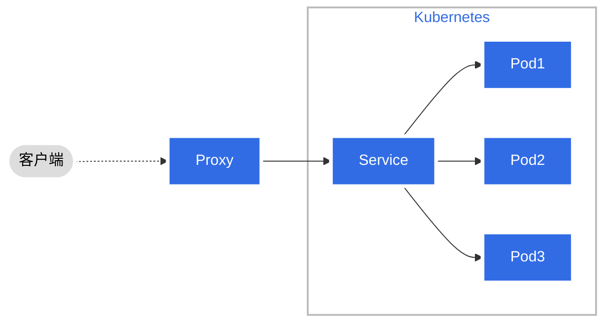
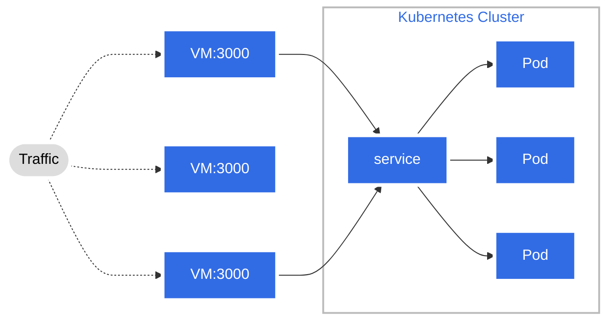
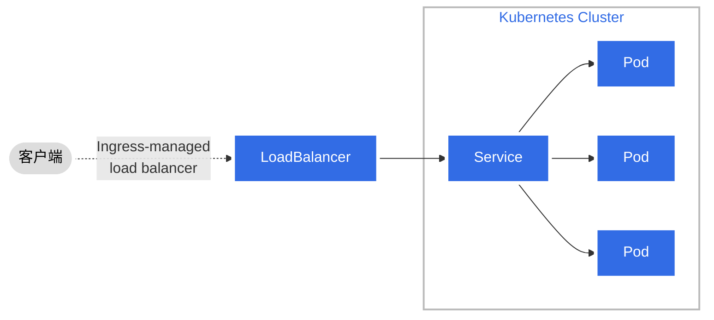
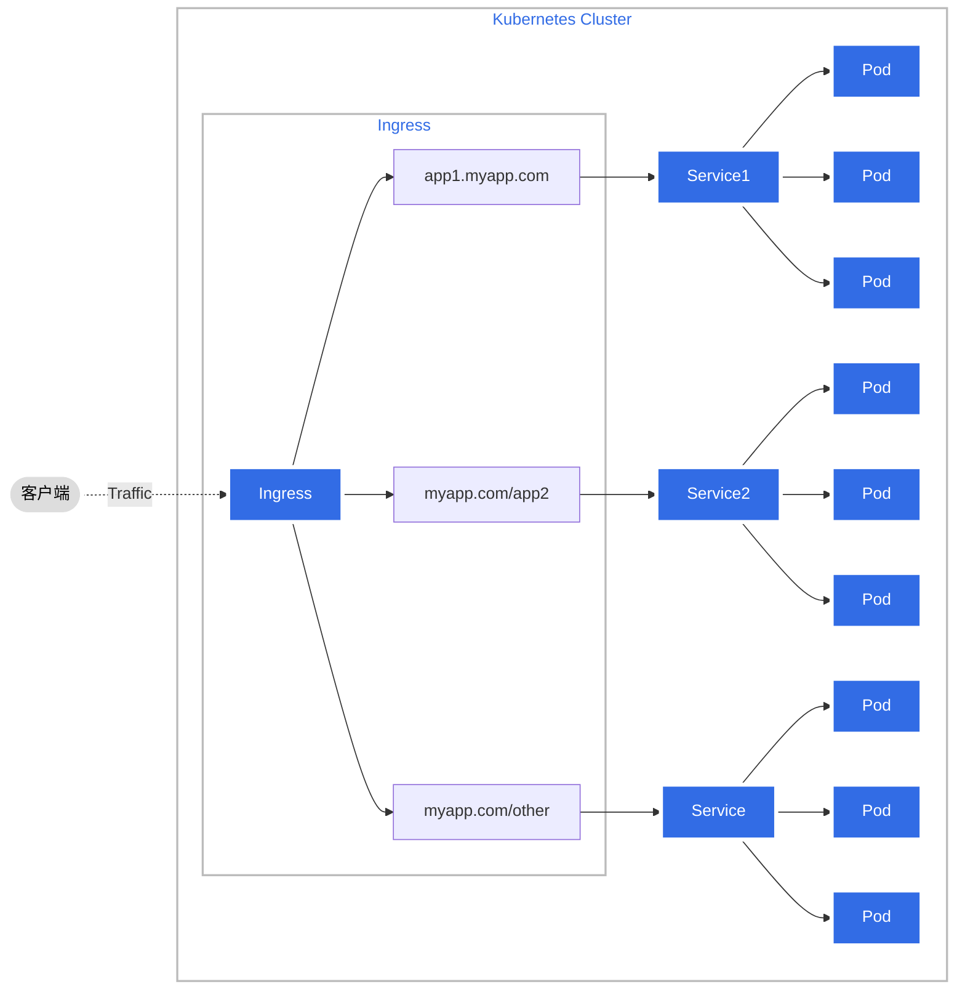

# Kubernetes 服务说明

本教程将解释四种 Kubernetes 服务类型之间的区别，以及您应该如何为您的应用程序选择最佳服务类型。

了解 ClusterIP、NodePort、LoadBalancer 和 Ingress

Kubernetes 已经成为管理和扩展云原生应用程序的强大工具。组织需要快速部署其软件，利用高度可扩展且始终可用的功能来保持零停机时间。随着越来越多的应用程序被容器化和部署，任何组织管理这些容器变得越来越复杂。因此，缩放成为一个问题。这就是 Kubernetes 大放异彩的地方。借助 Kubernetes，您可以轻松地自动化、部署、扩展和监控您的应用程序。

如果您已经阅读过有关 Kubernetes 服务和网络的任何文档，您可能已经遇到过 ClusterIP、NodePort、LoadBalancer 和 Ingress 等术语。围绕这些术语似乎存在很多混淆，在开始构建下一个基于 Kubernetes 的应用程序之前，您必须了解其中的区别。

本教程将解释这四种 Kubernetes 服务类型之间的区别，以及您应该如何为您的应用程序选择最佳服务类型。

了解应用程序的网络要求

Kubernetes 网络和服务是一个复杂的话题。您需要了解应用程序的需求，以便在 Kubernetes 上成功部署它。这意味着要了解要提供的服务类型、群集的大小和位置，以及希望应用程序接收的流量类型。

Kubernetes 支持四种类型的服务：ClusterIP、NodePort、LoadBalancer 和 Ingress。每个都有自己的一组要求，以便为应用程序启用它们，因此在部署之前必须了解需要哪一个。

例如，NodePort 允许同一节点内的 Pod 相互通信，而无需分配 IP 地址。您的 Kubernetes 集群必须至少有两个节点，这种类型的网络通信才能正常工作。此外，NodePort 仅在从群集内部访问时才有效，而 LoadBalancers 或 Ingress 则允许外部访问。让我们逐一了解它们的工作原理。

## 群集 IP

ClusterIP 是默认服务，它支持群集内多个 Pod 的通信。

默认情况下，如果不手动定义服务，则会在 ClusterIP 上公开该服务。无法从外部世界访问群集 IP。
但是，Kubernetes代理可用于访问您的服务。此服务类型用于工作负荷之间的内部网络，同时调试服务、显示内部仪表板等。

## NodePort

NodePort 是最简单的网络类型。它不需要配置，它只是将主机上随机端口上的流量路由到容器上的随机端口。这适用于大多数情况，但它确实有一些缺点：

- 您可能需要使用反向代理（如Nginx）来确保正确路由Web请求。
- 每个端口只能公开一个服务。
- 容器 IP 在每次启动时都会有所不同，因此无法进行 DNS 解析。
- 容器无法从容器外部访问本地主机，因为未配置 IP。

不过，您可以在试验期间和临时用例中使用 NodePort，例如演示、POC 和内部训练，以显示流量路由的工作原理。建议不要在生产环境中使用 NodePort 来公开服务。

## LoadBalancer

LoadBalancer 是 Kubernetes 网络最常用的服务类型。
它是一种标准的负载均衡器服务，在每个 Pod 上运行，并与外部世界（Internet 等网络或数据中心内）建立连接。

LoadBalancer 将使连接保持对已启动的 Pod 保持打开状态，并将连接与已关闭的 Pod 关闭。这类似于您在 AWS 上使用 ELB 或 Azure 上使用 Application Gateway。上游为 HTTP（S） 流量提供第 4 层路由，而下游为 HTTP（S） 流量提供第 7 层路由。

您可以在目标端口号、协议和主机名上路由流量，也可以使用应用程序标签。您几乎可以将任何类型的流量发送到此服务类型，例如 HTTP、TCP、UDP、Grpc 等。使用此方法直接公开服务。

## Ingress

Ingress 不被视为官方的 Kubernetes 服务，但它可以用来公开服务。您可以通过创建规则来定义哪些入站连接应到达哪些服务，从而配置入口服务。

Ingress是一个Kubernetes对象，它位于多个服务前面，充当智能路由器。它定义了外部流量如何到达群集服务，并配置了一组规则以允许入站连接访问群集上的服务。

入口规则通常由注释定义。入口控制器读取这些注释并相应地配置iptables或NGINX。有许多类型的入口控制器具有不同的功能。可以在此处找到入口控制器的列表。

Ingress 是用于公开服务的最强大的服务类型，它只需要维护一个负载均衡器，这比使用 LoadBalancer 服务类型更便宜。

| Feature       | ClusterIP                 | NodePort                                               | LoadBalancer                               |
|---------------|---------------------------|--------------------------------------------------------|--------------------------------------------|
| Exposition    | 在群集中的内部 IP 上公开服务          | 向外部客户端公开服务                                             | 向外部客户端公开服务                                 |
| Cluster       | 此类型使服务只能从群集内部访问           | 作为 NodePort 服务，每个群集节点在节点本身上打开一个端口，并将在该端口上接收的流量重定向到基础服务 | 可通过专用LB访问的LB服务，该服务从 Kubernetes 运行的云基础架构中预配 |
| Accessibility | 默认服务，内部客户端将请求发送到稳定的内部IP地址 | 服务可通过内部群集 IP 端口访问，也可以通过所有节点上的专用端口进行访问                  | 客户端通过负载均衡器的 IP 连接到服务                       |
| Yaml          | type: ClusterIP           | type: NodePort                                         | type: LoadBalancer                         |
| Port          | 集群的任意公开IP                 | 30000 - 32767                                          | 集群的公开IP                                    |
	
	
	

