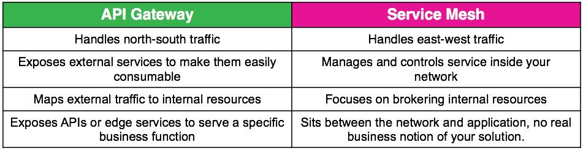
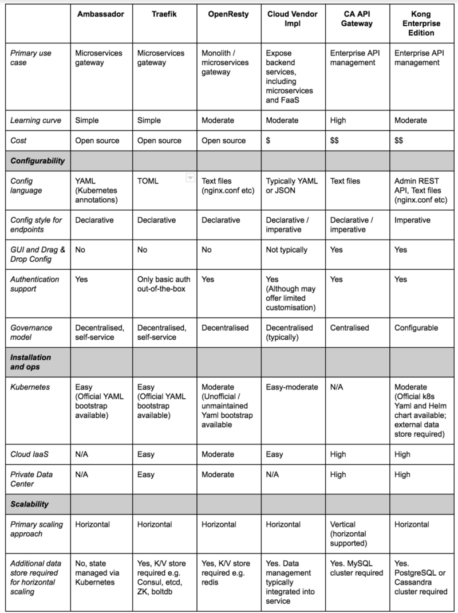
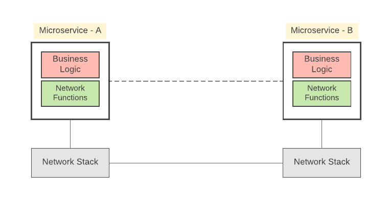
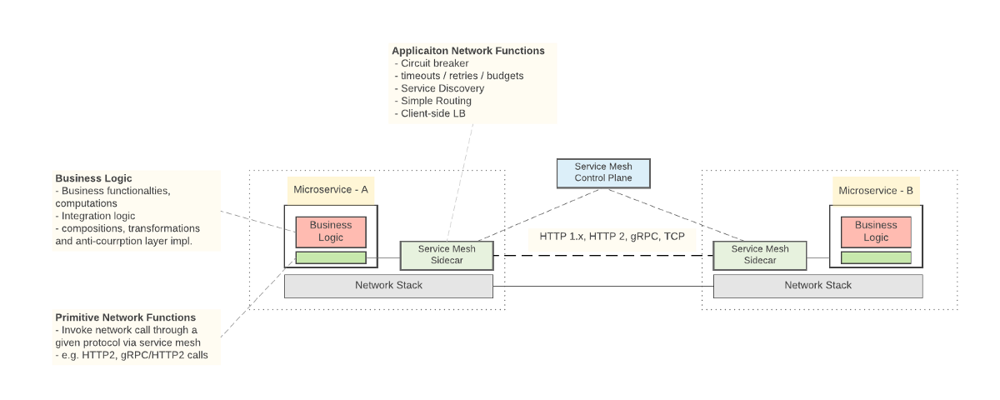

# No.19006 *API 网关-vs-服务网格 *

------

## api-gateway-vs-service-mesh

[英文原文](https://aspenmesh.io/2018/09/api-gateway-vs-service-mesh/)

### 前言

  我们在与人们谈论服务网格时遇到的一个反复出现的问题是，“它与API网关有何不同？”这是一个很好的问题。API网关和服务网格模式之间的重叠非常重要。它们既可以处理服务发现，也可以请求路由，身份验证，速率限制和监控。但是在架构和意图方面存在差异。服务网格的主要目的是管理内部服务到服务通信，而API网关主要用于外部客户端到服务通信。

常见API Gateway比较

### 你需要两个吗？

  您可能想知道是否需要API网关和服务网格。今天你可能会这样做，但随着服务网络的发展，我们相信它将包含你今天从API网关获得的大部分内容。

  API网关的主要目的是接受来自网络外部的流量并在内部进行分发。服务网格的主要目的是路由和管理网络中的流量。服务网格可以与API网关一起使用，以有效地接受外部流量，然后在网络中有效地路由该流量。这些技术的组合可以成为确保应用程序正常运行时间和弹性的有效方法，同时确保您的应用程序易于使用。

  在具有API网关和服务网格的部署中，来自群集外部的传入流量将首先通过API网关路由，然后进入网状网。API网关可以处理身份验证，边缘路由和其他边缘功能，而服务网格可以提供对结构的细粒度可观察性和控制。

  有趣的是，服务网格技术正在快速发展，并开始承担API网关的一些功能。一个很好的例子是引入了Aspen Mesh 1.0中提供的Istio v1alpha3路由API。在此之前，Istio使用了Kubernetes入口控制，这是非常基本的，因此使用API​​网关获得更好的功能是有意义的。但是，v1alpha3 API引入的增强功能使得管理大型应用程序和使用HTTP以外的协议变得更加容易，而以前的协议需要API网关才能有效地完成。

### 未来是什么样子的

  v1alpha3 API提供了一个很好的示例，说明服务网格如何减少对API网关功能的需求。随着云原生空间的发展和更多组织转向使用Docker和Kubernetes来管理其微服务架构，服务网格和API网关功能似乎很可能会合并。在接下来的几年中，我们相信独立的API网关将越来越少地被使用，因为它们的功能将被服务网格吸收。

## 服务网格与API网关

[service-mesh-vs-api-gateway](https://medium.com/microservices-in-practice/service-mesh-vs-api-gateway-a6d814b9bf56)

在我之前关于[服务网格的一篇文章中](https://medium.com/microservices-in-practice/service-mesh-for-microservices-2953109a3c9a)，有一些与Service Mesh和API Gateway之间的关系有关的问题。所以，在这篇文章中，我打算就Service Mesh和API Gateway的用途进行进一步讨论

  为了区分API网关和服务网格，让我们先仔细看看两者各自的关键特性。

### API网关：将您的服务作为托管API向外部公开

- 使用API​​网关的关键目标是将您的（微）服务公开为托管API（供外部系统访问）。因此，我们在API网关层开发的API或Edge服务提供特定的业务功能。
  
- API/Edge服务调用下游（复合和原子）微服务，并包含创建多个下游服务的组合/混搭的业务逻辑。
  
- API/Edge服务还需要以弹性方式调用下游服务，并应用各种稳定模式，如断路器，超时，负载平衡/故障转移。因此，大多数API网关解决方案都内置了这些功能。
  
- API网关还提供对服务发现，分析（可见性：度量，监控，分布式日志记录，分布式跟踪）和安全性的内置支持。
  
- API网关与API Management生态系统的其他几个组件密切配合，例如API marketplace/store，API发布门户。

### 服务网格

  现在让我们来看看我们如何区分Service Mesh。

  Service Mesh是一种网络通信基础设施，允许您从服务代码中分离和卸载大多数应用程序网络功能。
  
  因此，当您进行服务到服务通信时，您不需要实现弹性通信模式，例如断路器，服务代码中的超时。类似地，服务网格提供其他功能，例如服务发现，可观察性等。

### API网关和服务网格在行动

  API网关和服务网关之间的关键区别在于，API网关是公开API / Edge服务的关键部分，其中服务网格只是一种服务间通信基础设施，没有任何解决方案的商业概念。

  图1说明了API网关和服务网格如何存在。如上所述，还有一些重叠的功能（例如断路器等），但重要的是要理解这两个概念正在满足根本不同的要求。

<https://cdn-images-1.medium.com/max/1200/1*JHrJe_8TO05wRQvwhwoKfA.png>

  图1：API网关和服务网格的实际应用

  如图1所示，服务网格与大多数服务实现一起用作边车，并且它独立于服务的业务功能。

  另一方面，API Gateway托管所有API服务（具有明确定义的业务功能），并且它是解决方案的业务功能的一部分。API网关可能具有内置的服务间通信功能，但不会阻止使用服务网格的API网关调用下游服务（API网关 - >服务网格 - >微服务）。

>在API管理级别，您可以使用API​​网关的内置服务间通信功能，或者API网关可以通过将应用程序网络功能卸载到服务网格来通过服务网络调用下游服务。

 API Gateway作为微服务引用的流量入口，其对效率要求较高，如果随API Gateway部署一个Sidecar，可能对效率有一定影响。

## 微服务的服务网格

[微服务的服务网格](https://medium.com/microservices-in-practice/service-mesh-for-microservices-2953109a3c9a)

  微服务架构在过去几年中发展很多，并且出现了许多新的概念和模式。'Service Mesh'概念越来越受欢迎。在这篇文章中，我计划涵盖与Service Mesh相关的关键概念以及它如何在实际的微服务实现中使用。

### 为什么要用'服务网格'？

  与许多新兴技术一样，微服务架构也有很多炒作。大多数人认为微服务可以解决他们以前的架构（例如SOA/ESB）所遇到的所有问题。但是，当我们观察现实世界的微服务实现时，我们可以看到服务集成总线（ESB）支持的大多数功能及应用场景现在都在微服务级别实现。因此，两者或多或少地解决了同一类问题，但我们正在使用微服务在不同维度上解决它们。

   图1：从服务集成总线/ESB到微服务
  
例如，让我们假设您需要以弹性方式调用多个下游服务，并将功能公开为另一个（复合）服务。如图1所示，通过ESB架构，您可以轻松利用ESB的内置功能，构建虚拟/复合服务和功能，如断路器，超时和服务发现等，这些在服务间通信中非常有用。

当您使用微服务实现相同的场景时，您不再拥有集中式集成/ESB层，而是一组（复合和原子）微服务。因此，您必须在微服务级别实现所有这些功能。

图2：微服务组件和服务到服务通信

  因此，与其他服务通信的给定微服务（图2）包括：

- **业务逻辑**，实现业务功能，计算和服务组合/集成逻辑。
- **网络功能**，负责处理服务间通信机制（通过给定协议进行基本服务调用，应用弹性和稳定性模式，服务发现等）。这些网络功能构建在底层操作系统级网络堆栈之上。

  现在想想实现这种微服务所需的努力。从头开始实现与功能相关的服务到服务通信是一场噩梦。而是专注于业务逻辑，您将不得不花费大量时间来构建服务到服务通信功能。如果你使用多种技术来构建微服务（例如图1所示的多种编程语言），那就更糟了，因为你需要在不同的语言中复制相同的工作（例如断路器必须在Java，Node， Python等）。

> **实现微服务架构中最复杂的挑战不是自己构建服务，而是服务之间的通信。**

  由于大多数服务间通信要求在所有微服务实现中都非常通用，我们可以考虑将所有这些任务卸载到不同的层，以便我们可以保持服务代码独立。这就是'服务网格'进入图片的地方。

### 什么是“服务网格”？

  简而言之，Service Mesh是一种服务间通信基础设施。

#### 使用服务网格，

- 给定的微服务不会直接与其他微服务通信。
- 相反，所有服务到服务通信都将在称为服务网格（或侧面车辆代理）的软件组件的顶部进行。
- Service Mesh为一些网络功能提供内置支持，例如弹性，服务发现等。
- 因此，服务开发人员可以更多地关注业务逻辑，同时将与网络通信相关的大部分工作卸载到服务网格。
- 例如，当您的微服务再次调用其他服务时，您不必担心电路中断。这已经成为服务网格的一部分。
- 服务网格与语言无关：由于服务网络代理通信的微服务始终位于标准协议（如HTTP1.x / 2.x，gRPC等）之上，因此您可以使用任何技术编写微服务，它们仍然可以使用服务网格。

  图3：使用Service Mesh进行服务通信的服务

让我们尝试进一步理解服务交互和责任，如图3所示。

### 商业逻辑

  服务实现应包含给定服务的业务功能的实现。这包括与其业务功能，计算，与其他服务/系统（包括遗留，专有和SaaS）或服务组合的集成，复杂的路由逻辑，不同消息类型之间的映射逻辑等相关的逻辑。

### 原始网络功能

  虽然我们将大多数网络功能卸载到服务网格，但是给定服务必须包含与服务网格/侧车代理连接的基本高级网络交互。因此，给定的服务实现必须使用给定的网络库（与ESB世界不同，您只需要使用非常简单的抽象）来启动网络调用（仅限服务网格）。在大多数情况下，微服务开发框架嵌入了用于这些功能的所需网络库。

### 应用网络功能

  存在紧密耦合到网络的应用功能，例如断路，超时，服务发现等。这些功能明确地与服务代码/业务逻辑分离，并且服务网络促进了开箱即用的那些功能。

>大多数初始微服务实现只是忽略了从中央ESB层提供的网络功能的严重性，并且他们在每个微服务级别从头开始实现所有这些功能。现在，他们已经开始意识到具有与分布式网格类似的共享功能的重要性。

### 服务网格控制平面

所有服务网格代理都由控制窗格集中管理。在支持服务网格功能（如访问控制，可观察性，服务发现等）时，这非常有用。

### 服务网格的功能

  正如我们之前所见，服务网格提供了一组应用程序网络功能，而一些（原始）网络功能仍然在微服务级别本身实现。关于应该从服务网格提供哪些功能，没有硬性规定。这些是服务网格提供的最常见功能。

- 服务间通信的灵活性：断路，重试和超时，故障注入，故障处理，负载平衡和故障转移。
- 服务发现：通过专用服务注册表发现服务端点。
- 路由：原始路由功能，但没有与服务的业务功能相关的路由逻辑。
- 可观察性：度量，监控，分布式日志记录，分布式跟踪。
- 安全性：传输级安全性（TLS）和密钥管理。
- 访问控制：简单的黑名单和基于白名单的访问控制。
- 部署：对容器的本机支持。Docker和Kubernetes。
- Interservice通信协议：HTTP1.x，HTTP2，gRPC

### 服务网格实现

  Linkerd和Istio是两种流行的开源服务网格实现。它们都遵循类似的架构，但实现机制不同。您可以在[1]中找到这两个服务网格实现之间的非常好的比较。

### 服务网 - 优点和缺点

让我们快速浏览一下服务网格的优缺点。

#### **优点**

- 商品功能在微服务代码之外实现，并且可以重复使用。

- 解决微服务架构中的大多数问题，我们过去常常使用ad-hoc解决方案：分布式跟踪，日志记录，安全性，访问控制等。
- 选择微服务实现语言时更自由：您无需担心给定语言是否支持或具有构建网络应用程序功能的库。

#### **缺点**

- **复杂性**：拥有服务网格会大大增加您在给定的微服务实现中拥有的运行时实例的数量。

- 添加额外的跃点：每个服务调用都必须通过额外的跃点（通过服务网格边车代理）。

- **服务网格只解决了问题的一个子集**：服务网格只解决了服务间通信问题的一个子集，但是存在许多复杂的问题，例如复杂的路由，转换/类型映射，与其他服务和系统集成，需要解决您的微服务的业务逻辑。

- **不成熟**：服务网格技术相对较新，可以宣布为大规模部署的完整生产。

### 结论

  总之，服务网络解决了微服务架构实现的一些关键挑战。它为您提供了更多自由选择各种微服务实现技术，以及更多地关注业务逻辑，而不是在服务之间投入更多时间在网络功能上。但是，服务网格不会解决任何业务逻辑相关或服务集成/组合相关的问题。

更新：“Service Mesh vs API Gateway”？

有关此问题的更多信息，请查看前面的文章 API Gateways与Service Mesh。

